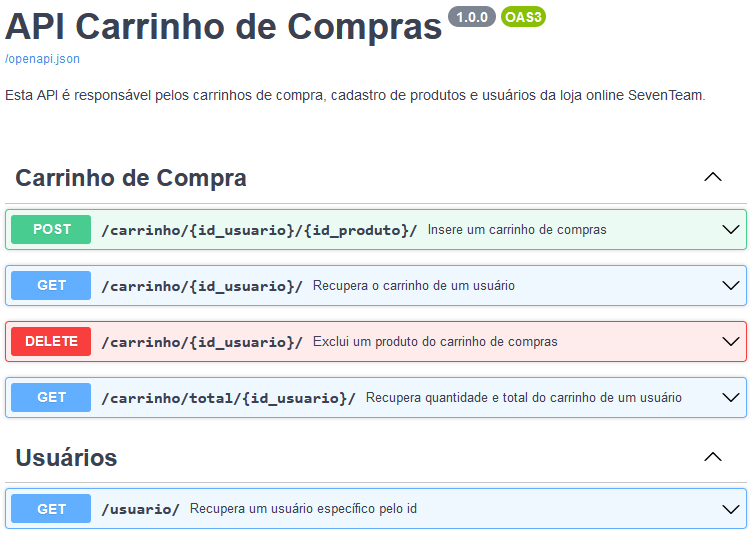
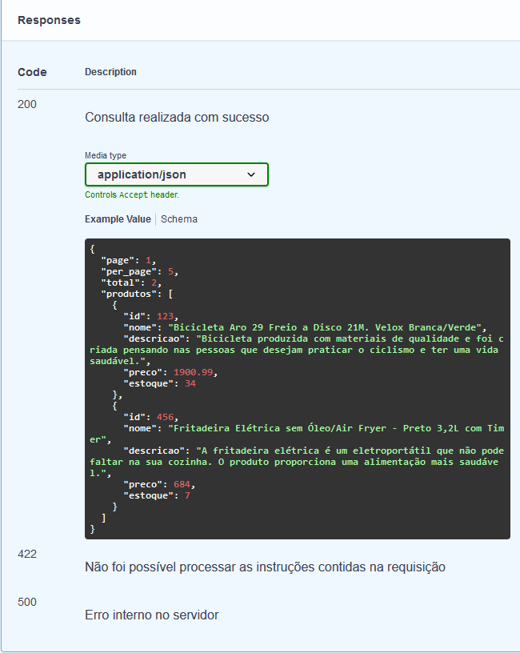

# luizacode-projeto1
## Carrinho de Compras (Projeto 1) - Luiza Code
Projeto do bootcamp Luiza Code do Magazine Luiza.

Desenvolvimento de uma API de carrinho de compras, utilizando FastAPI.

## Opções da API:
A API permite a criação e exclusão dos registros abaixo, bem como diversos tipos de consulta.
* Produtos
* Usuários
* Endereços
* Carrinho

## Dependências
* FastAPI = Framework Python utilizado no desenvolvimento de API's.
* Pydantic = Biblioteca que implementa a validação de dados para Python.
* Uvicorn = Framework que dá a base dos componentes assíncronos do FastAPI.

## Documentação
A documentação da API está em construção.</br>
Vários pontos já foram lapidados, mas ainda há trabalho a fazer.</br>
*O FastAPI gera automaticamente a documentação no OpenAPI (Swagger),</br>
mas é importante que o conteúdo seja complementado.
* Após iniciar o servidor da API, a documentação ficará disponível no endereço:</br>
http://localhost:8000/docs
</br>




## Instalação (Windows)
* Criar ambiente virtual
    ```
    $ python -m venv venv
    ```
* Ativar ambiente

    ```
    $ .\venv\Scripts\Activate.ps1
   ```
* Instalar dependências
     ```
     $ pip install -r requirements.txt
     ```
* Iniciar o servidor
    ```
    uvicorn main:app --reload
    ```